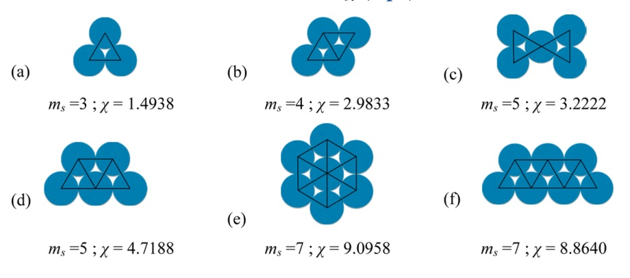

SGTPy.component
=================

:class:`SGTPy.component` object stores pure component information needed to evaluate SAFT-VR-Mie EoS for phase equilibria and interfacial properties computation.

The simplest scenario is coarse-grained (CG) non-associating non-polar fluids. The parameters needed for these molecules are the numbers of segments (:math:`m_s`), well-depth of Mie potential (:math:`\epsilon`) in K units, size parameter of Mie potential (:math:`\sigma`) in Å (:math:`10^{-10}` m), attractive (:math:`\lambda_a`) and repulsive (:math:`\lambda_r`) exponents of Mie Potential
A component can be created as follows:

>>> from SGTPy import component
>>> methane = component('methane', ms=1.0, sigma=3.752 , eps=170.75, lambda_r=16.39, lambda_a=6.)
>>> dodecane = component('dodecane', ms=4.0, sigma=4.351, eps=378.56, lambda_r=18.41, lambda_a=6.)

The molecular parameters for CG molecules can be obtained from the `Bottled-saft webpage <http://www.bottledsaft.org/>`_.
Additionally, a simple corresponding state parametrization [1]_ is available through SGTPy. This parametrization requires the critical temperature (``Tc``), acentric factor (``w``) and depend on the desired number of segments (:math:`m_s`) and the liquid density at a reduced temperature equal to 0.7 in mol/m :math:`^3`.

>>> hexane = component('hexane', Tc= 507.6, w=0.301261)
>>> hexane.saftvrmie_forcefield(ms=2, rhol07=6973.5)
>>> # sigma in meters, epsilon in K and lambda_r
... (4.510744361846902e-10, 373.5197182392722, 19.43607049398115)

The SAFT-VR-Mie EoS has been extended to homonuclear rings [2]_, for these type of fluids and additional geometric parameter (:math:`\chi`, ``ring`` in SGTPY) is needed.

A ring molecule can be created as follows:

>>> benzene = component('benzene', ms=3, sigma=3.441, eps=230.30, lambda_r=10.45, lambda_a=6.,
...                      ring=1.4938)

For the case of pure self-associating fluid, three extra parameters are needed:  the association energy (:math:`\epsilon^{AB}`) in K units, the association range (:math:`r_c^{AB}/\sigma`) and association center position (:math:`r_d^{AB}/\sigma`). the association scheme is characterized by the triple [B, P, N], which indicates the number of bipolar, positive and negative association sites, respectively. An equivalence table for common association schemes and the [B, P, N] triplet is shown below.

==================      =========
Association Scheme      [B, P, N]
==================      =========
1                       [0, 0, 1]
2B                      [0, 1, 1]
2C                      [1, 0, 1]
3B                      [0, 1, 2]
4B                      [0, 3, 1]
4C                      [0, 2, 2]
==================      =========

Parameters for self-associating fluid, i.e. alcohols and water, for SAFT-VR-Mie can be found in Ref. [3]_. An associating molecule can be created as follows:

>>> water = component('water', ms = 1.7311, sigma = 2.4539 , eps = 110.85,
...                    lambda_r = 8.308, lambda_a = 6., eAB = 1991.07, rcAB = 0.5624,
...                    rdAB = 0.4, sites = [0,2,2])

Additionally, a polar contribution [4]_ can be accounted for, this contribution requires the definition of a dipolar moment (:math:`\mu`, ``mupol`` in SGTPy)  in Debye units, and the number of polar sites (:math:`n_p`, ``npol`` in SGTPy). Molecular parameters for polar molecules can be found in Ref. [3]_ and [5]_.

>>> butanol = component('butanol2C', ms = 1.9651, sigma = 4.1077 , eps = 277.892,
...                    lambda_r = 10.6689, lambda_a = 6., eAB = 3300.0, rcAB = 0.2615,
...                    rdAB = 0.4, sites = [1,0,1], npol = 1.45, mupol = 1.6609)

Finally, in order to model the interfacial behavior, the influence parameter  (:math:`c_{ii}`) in J m :math:`^5` / mol :math:`^2` is required.

>>> water = component('water', ms = 1.7311, sigma = 2.4539 , eps = 110.85,
...                    lambda_r = 8.308, lambda_a = 6., eAB = 1991.07, rcAB = 0.5624,
...                    rdAB = 0.4, sites = [0,2,2], cii = 1.5371939421515458e-20)
>>> butanol = component('butanol2C', ms = 1.9651, sigma = 4.1077 , eps = 277.892,
...                    lambda_r = 10.6689, lambda_a = 6., eAB = 3300.0, rcAB = 0.2615,
...                    rdAB = 0.4, sites = [1,0,1], npol = 1.45, mupol = 1.6609,
...                    cii  = 1.5018715324070352e-19)

.. warning:: User is required to supply the necessary parameters for the EoS to work properly

.. autoclass:: SGTPy.component
    :members:

.. [1] `Industrial and Engineering Chemistry Research, 53(10), 4131–4141 (2014). <https://pubs.acs.org/doi/10.1021/ie404247e>`_
.. [2] `Langmuir, 33(42), 11518–11529 (2017). <https://pubs.acs.org/doi/abs/10.1021/acs.langmuir.7b00976>`_
.. [3] `Industrial and Engineering Chemistry Research, 57(29), 9693–9706 (2018). <https://pubs.acs.org/doi/10.1021/acs.iecr.8b01042>`_
.. [4] `AIChE Journal, 52(3), 1194–1204. (2006). <https://aiche.onlinelibrary.wiley.com/doi/10.1002/aic.10683>`_
.. [5] `Fluid Phase Equilibria, 455, 24–42 (2018) <https://www.sciencedirect.com/science/article/abs/pii/S0378381217303655>`_
