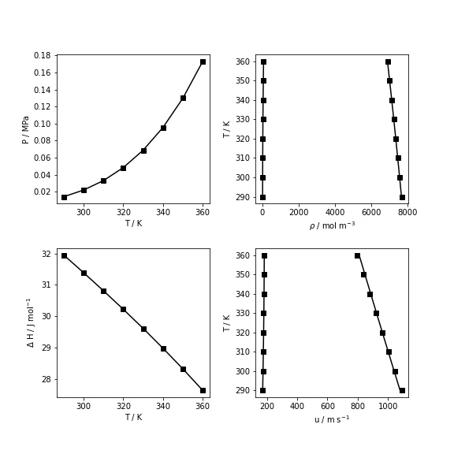
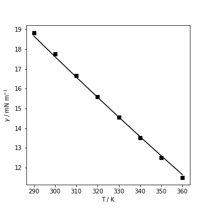

Pure component data
===================

Molecular EoS, like SAFT-VR-Mie, can be parametrized using experimental saturation data (pressure and densities).  Additionally, thermal derived properties can be included to improve the modeling of the fluid, this data includes heat capacities, vaporization enthalpy and speed of sound.
The experimental data can be obtained from NIST database, DIPPR 801, TDE, Knovel or by your own measurements.

In the following example, the molecular parameters of n-hexane will be fitted. First, the saturation pressure and density, as well as, the speed of sound and enthalpies are obtained from NIST database.

>>> import numpy as np
>>> # Experimental data obtained from NIST WebBook
>>> Tsat = np.array([290., 300., 310., 320., 330., 340., 350., 360.]) # K
>>> Psat = np.array([ 14016.,  21865.,  32975.,  48251.,  68721.,  95527., 129920., 173260.]) # Pa
>>> rhol = np.array([7683.6, 7577.4, 7469.6, 7360.1, 7248.7, 7135. , 7018.7, 6899.5]) # mol/m3
>>> rhov = np.array([ 5.8845,  8.9152, 13.087, 18.683, 26.023, 35.466, 47.412, 62.314]) #mol/m3
>>> # speed of sound
>>> speed_liq = np.array([1090.6, 1047.6, 1005.1,  963.05,  921.37,  880.,  838.85, 797.86])  # m/s
>>> speed_vap = np.array([170.71, 172.79, 174.62, 176.17, 177.42, 178.33, 178.87, 179.01])  # m/s
>>> # enthalpies
>>> Hl = np.array([-10427., -8496.9, -6530.1, -4525., -2480., -393.68, 1735.3, 3908.5]) # J/mol
>>> Hv = np.array([21525., 22893., 24285., 25699., 27135., 28589., 30062., 31549.]) #J/mol
>>> Hvap = Hv - Hl
>>> # interfacial tension
>>> iftexp = np.array([18.842, 17.746, 16.665, 15.6  , 14.549, 13.516, 12.499, 11.5  ])  # mN/m

As the available experimental data could vary from one fluid to another, we suggest creating a simple objective function depending on the available information. The following objective function ``fobj`` measures the error from the saturation pressure, liquid density and vapor density (weighted) for a given set of chain length (``ms``), potential energy (``eps``), size parameter (``sigma``) and repulsive exponent (``lambda_r``). The attractive exponent is set to 6.

>>> from SGTPy import component, saftvrmie
>>> # objective function to optimize molecular parameters
>>> def fobj(inc):
>>>    ms, sigma, eps, lambda_r = inc
>>>     pure = component(ms = ms, sigma = sigma , eps = eps, lambda_r = lambda_r , lambda_a = 6.)
>>>    eos = saftvrmie(pure)
>>>
>>>    #Pure component pressure and liquid density
>>>    P = np.zeros_like(Psat)
>>>    vl = np.zeros_like(rhol)
>>>    vv = np.zeros_like(rhov)
>>>    n= len(Psat)
>>>    for i in range(n):
>>>        P[i], vl[i], vv[i] = eos.psat(Tsat[i], Psat[i])
>>>
>>>    rhosaftl = 1/vl
>>>    rhosaftv = 1/vv
>>>
>>>    error = np.mean(np.abs(P/Psat - 1))
>>>    error += np.mean(np.abs(rhosaftl/rhol - 1))
>>>    error += 0.1*np.mean(np.abs(rhosaftv/rhov - 1))
>>>
>>>    return error

The objective function ``fobj`` is optimized with SciPy's minimize function.

>>> from scipy.optimize import minimize
>>> # initial guess for ms, sigma, eps and lambda_r
>>> inc0 = np.array([2.0, 4.52313581 , 378.98125026,  19.00195008])
>>> method = 'Nelder-Mead'
>>> minimize(fobj, inc0, method = method)
>>> # x: array([  1.96834567,   4.5462554 , 376.94027466,  18.34400374])

More information about the fluid can be included in the objective function. ``fobj`` incorporates the speed of sounds to fit the molecular parameters.  In order to include this calculation, it is required to compute the ideal gas contribution to the heat capacities and also to supply the molecular weight to the component object.

>>> # Ideal gas heat capacities from DIPPR 801
>>> R = 8.314 # J/mol K
>>> k1=104400
>>> k2=352300
>>> k3=1694.6
>>> k4=236900
>>> k5=761.6
>>> CpId = k1 + k2 * ((k3/Tsat) /np.sinh(k3/Tsat))**2
>>> CpId += k4 * ((k5/Tsat) /np.cosh(k5/Tsat))**2
>>> CpId /= 1000.  # J/mol K
>>> CvId = CpId - R  # J/ mol K
>>> # objective function to optimize molecular parameters
>>> def fobj2(inc):
>>>    ms, sigma, eps, lambda_r = inc
>>>    pure = component(ms = ms, sigma = sigma , eps = eps, lambda_r = lambda_r , lambda_a = 6., Mw = 86.18)
>>>    eos = saftvrmie(pure)
>>>    #Pure component pressure and liquid density
>>>    P = np.zeros_like(Psat)
>>>    vl = np.zeros_like(rhol)
>>>    vv = np.zeros_like(rhov)
>>>
>>>    ul = np.zeros_like(speed_liq)
>>>    uv = np.zeros_like(speed_vap)
>>>
>>>    n= len(Psat)
>>>    for i in range(n):
>>>        P[i], vl[i], vv[i] = eos.psat(Tsat[i], Psat[i])
>>>        ul[i] = eos.speed_sound(Tsat[i], P[i], 'L', v0=vl[i], CvId=CvId[i], CpId=CpId[i])
>>>        uv[i] = eos.speed_sound(Tsat[i], P[i], 'V', v0=vv[i], CvId=CvId[i], CpId=CpId[i])
>>>
>>>    rhosaftl = 1/vl
>>>    rhosaftv = 1/vv
>>>
>>>    error = np.mean(np.abs(P/Psat - 1))
>>>    error += np.mean(np.abs(rhosaftl/rhol - 1))
>>>    error += 0.2*np.mean(np.abs(ul/speed_liq - 1))
>>>    error += 0.2*np.mean(np.abs(uv/speed_vap - 1))
>>>
>>>    return error

The optimization procedure is similar to the one explained above.

>>> # initial guess for ms, sigma, eps and lambda_r
>>> inc0 = np.array([  1.96834567,   4.5462554 , 376.94027466,  18.34400374])
>>> method = 'Nelder-Mead'
>>> minimize(fobj2, inc0, method = method)
>>> # x: array([  2.24922708,   4.30485061, 323.02126482,  15.14312848])

The computed equilibria, enthalpy of vaporization and speed of sound using the optimized molecular parameters are compared against experimental data in the following figure.

Influence parameter for SGT
---------------------------

Finally, influence parameters are necessary to compute interfacial properties, these can be fitted with experimental interfacial tension and the computed phase equilibria.

>>> from SGTPy.fit import fit_cii
>>> ms, sigma, eps, lambda_r = np.
>>> pure = component(ms = ms, sigma = sigma , eps = eps, lambda_r = lambda_r , lambda_a = 6., Mw = 86.18)
>>> eos = saftvrmie(pure)
>>> # P, rhosaftl, rhosaftv were computed previously
>>> fit_cii(iftexp, Tsat, P, rhosaftl, rhosaftv, eos)
>>> # 3.5861724177599335e-19

.. automodule:: SGTPy.fit.fit_cii
    :members: fit_cii
    :undoc-members:
    :show-inheritance:
    :noindex:

The performance of the fitted influence parameters can be compared against the experimental data (squares).

