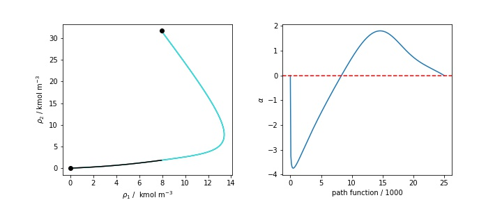
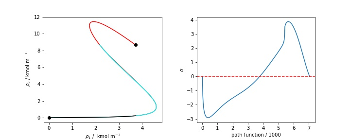

SGT for mixtures and :math:`\beta_{ij} = 0`
===========================================

When working with mixtures, SGT solution procedure depends on whether the influence parameter matrix is singular or not. The geometric mean rule leads to a singular matrix when all :math:`\beta_{ij} = 0`. In those cases, the boundary value problem (BVP) can not be solved and alternative methods have to be used. One of the options is the reference component method, which is the most popular. For this method the following system of equations has to be solved:

.. math::
	\sqrt{c_r} \left[ \mu_j(\rho) -  \mu_j^0 \right] = \sqrt{c_j} \left[ \mu_r(\rho)  -  \mu_r^0 \right] \qquad j \neq r

Where the subscript :math:`r` refers to the reference component and :math:`j` to the other components present in the mixture. Although the implementation of this method is direct it may not be suitable for mixtures with several stationary points in the interface. In those cases a path function is recommended,  Liang proposed the following path function:

.. math::
	h = \sum_i \sqrt{c_i} \rho_i

This path function has a known value when the equilibrium densities are available. Also the solution procedure allows to formulate an auxiliary variable :math:`\alpha = (\mu_i - \mu_i^0)/\sqrt{c_i}`. This variable gives information about whether the geometric mean rule is suitable for the mixture.

The ``sgt_mix_beta0`` function allows to compute interfacial tension and density profiles using SGT and :math:`\beta_{ij} = 0`, its use is showed in the following code block for the mixture of ethanol and water:

>>> from SGTPy import component, mixture, saftvrmie
>>> from SGTPy.equilibrium import flash
>>> water = component('water', ms = 1.7311, sigma = 2.4539 , eps = 110.85,
...                    lambda_r = 8.308, lambda_a = 6.,  eAB = 1991.07, rcAB = 0.5624,
...                    rdAB = 0.4, sites = [0,2,2], cii = 1.5371939421515455e-20)
>>> ethanol = component('ethanol2C', ms = 1.7728, sigma = 3.5592 , eps = 224.50,
...                     lambda_r = 11.319, lambda_a = 6., eAB = 3018.05, rcAB = 0.3547,
...                     rdAB = 0.4, sites = [1,0,1], cii= 5.3141080872882285e-20)
>>> mix = mixture(ethanol, water)
>>> kij, lij = np.array([-0.0069751 , -0.01521566])
>>> Kij = np.array([[0, kij], [kij, 0]])
>>> Lij = np.array([[0., lij], [lij, 0]])
>>> # setting interactions corrections
>>> mix.kij_saft(Kij)
>>> mix.lij_saft(Lij)
>>> # creating eos model
>>> eos = saftvrmie(mix)
>>> T = 298.15 # K
>>> # liquid composition
>>> x = np.array([0.2, 0.8])
>>> # initial guesses
>>> P0 = 1e4 # Pa
>>>y0 = np.array([0.8, 0.2])
>>> #The full_output option allows to obtain the compositions and volume of the phases
>>> sol = bubblePy(y0, P0, x, T, eos, full_output=True)
>>> y, P = sol.Y, sol.P
>>> vl, vv = sol.v1, sol.v2
>>> #computing the density vectora
>>> rhol = x/vl
>>> rhov = y/vv

As the equilibrium is already computed, the interfacial tension of the mixture can be calculated.

>>> #if reference component is set to ethanol (index = 0) a lower value is obtained as the
>>> #full density profile was not calculated because of a stationary point in the interface
>>> solr1 = sgt_mix_beta0(rhov, rhol, T, P, eos, s=0, method='reference', full_output=True)
>>> #water doesnt show surface activity across the interface
>>> #and the density profiles are fully calculated
>>> solr2 = sgt_mix_beta0(rhov, rhol, T, P, eos, s=1, method='reference', full_output=True)
>>> #Using Liang path function the density profiles are computed directly
>>> soll = sgt_mix_beta0(rhov, rhol, T, P, eos, n=300, method='liang', full_output=True)

The following results are obtained from each method, it can be seen that the results from the path function and with the reference component method using component two as reference are the same.

- Reference component method (1) :  14.698312812670265 mN/m
- Reference component method (2) :  32.947023168668835 mN/m
- Liang path Function :  32.944051807272245 mN/m

The density profiles computed from each method are plotted in the following figure. Black line was computed with reference component 1, Cyan line was computed with reference component 2 and Liang path function results are plotted with a red line.

A more challenging mixture to analyze is ethanol and hexane. This mixture has several stationary points across the interface making its calculations tricky. Similar to before, equilibrium has to be computed.

>>> ethanol = component('ethanol2C', ms = 1.7728, sigma = 3.5592 , eps = 224.50,
...                     lambda_r = 11.319, lambda_a = 6., eAB = 3018.05, rcAB = 0.3547,
...                     rdAB = 0.4, sites = [1,0,1], cii= 5.3141080872882285e-20)
>>> hexane = component('hexane', ms = 1.96720036, sigma = 4.54762477, eps = 377.60127994,
...                   lambda_r = 18.41193194, cii = 3.581510586936205e-19)
>>> mix = mixture(hexane, ethanol)
>>> kij = 0.011818492037463553
>>> Kij = np.array([[0, kij], [kij, 0]])
>>> mix.kij_saft(Kij)
>>> eos = saftvrmie(mix)
>>> T = 298.15 # K
>>> x = np.array([0.3, 0.7])
>>> y0 = 1.*x
>>> P0 = 8000. # Pa
>>> sol = bubblePy(y0, P0, x, T, eos, full_output=True)
>>> y, P = sol.Y, sol.P
>>> vl, vv = sol.v1, sol.v2
>>> rhox = x/vl
>>> rhoy = y/vv

Similar to the first example, all the possible methods will be tested.

>>> solr1 = sgt_mix_beta0(rhov, rhol, T, P, eos, s=0, method='reference', full_output=True)
>>> solr2 = sgt_mix_beta0(rhov, rhol, T, P, eos, s=1, method='reference', full_output=True)
>>> soll = sgt_mix_beta0(rhov, rhol, T, P, eos, n=300, method='liang', full_output=True)

The interfacial tension results from each method are listed below.

- Reference component method (1) :  9.550416968670147 mN/m
- Reference component method (2) :  14.807217440751549 mN/m
- Liang path Function:  16.826107984574268 mN/m

It can be seen that each method computed a different value, an inspection of the calculated density profiles can help to decide if any of them is correct. Black line was computed with reference component 1, Cyan line was computed with reference component 2 and Liang path function results are plotted with a red line.

Clearly, only Liang's path function was able to compute the density profiles of the mixture. An inspection on the :math:`\alpha` parameter from Liang's path function reveals that its final value is zero, when this is not fulfilled Liang states that the geometric mean rule might no be suitable for the mixture and a :math:`\beta_{ij}` correction should be applied.

.. automodule:: SGTPy.sgt.sgt_beta0
    :members: sgt_mix_beta0
    :undoc-members:
    :show-inheritance:

Individual functions for each method can be accessed through the :class:`SGTPy.sgt.ten_beta0_reference` for reference component method and  :class:`SGTPy.sgt.ten_beta0_sk` for Liang path function.
