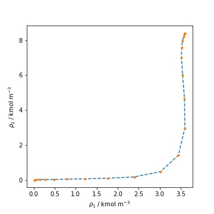

SGT for mixtures and :math:`\beta_{ij} \neq 0`
==============================================

When working with mixtures and at least one :math:`\beta_{ij} \neq 0`, SGT has to be solved as a boundary value problem (BVP)with a finite interfacial length.

.. math::
	\sum_j c_{ij} \frac{d^2 \rho_j}{dz^2} = \mu_i - \mu_i^0 \qquad i = 1,...,c

.. math::
	\rho(z \rightarrow 0) = \rho^\alpha \qquad \rho(z \rightarrow L) = \rho^\beta

In SGTPy two solution procedure are available for this purpose, both on them relies on orthogonal collocation. The first one, solve the BVP at a given interfacial length, then it computes the interfacial tension. After this first iteration, the interfacial length is increased and the density profiles are solved again using the obtained solution as an initial guess, then the interfacial tension is computed again. This iterative procedure is repeated until the interfacial tension stops decreasing within a given tolerance (default value 0.01 mN/m). This procedure is inspired by the work of Liang and Michelsen.

First, as for any SGT computation, equilibria has to be computed.

>>> ethanol = component('ethanol2C', ms = 1.7728, sigma = 3.5592 , eps = 224.50,
...                     lambda_r = 11.319, lambda_a = 6., eAB = 3018.05, rcAB = 0.3547,
...                     rdAB = 0.4, sites = [1,0,1], cii= 5.3141080872882285e-20)
>>> hexane = component('hexane', ms = 1.96720036, sigma = 4.54762477, eps = 377.60127994,
...                   lambda_r = 18.41193194, cii = 3.581510586936205e-19)
>>> mix = mixture(hexane, ethanol)
>>> kij = 0.011818492037463553
>>> Kij = np.array([[0, kij], [kij, 0]])
>>> mix.kij_saft(Kij)
>>> eos = saftvrmie(mix)
>>> T = 320 #K
>>> X = np.array([0.3, 0.7])
>>> P0 = 3e4 # Pa
>>> Y0 = np.array([0.7, 0.3])
>>> sol = bubblePy(Y0, P0, X, T, eos, full_output = True)
>>> Y = sol.Y
>>> P = sol.P
>>> vl = sol.v1
>>> vv = sol.v2
>>> # computing the density vector
>>> rhol = X / vl
>>> rhov = Y / vv

The correction :math:`\beta_{ij}` has to be supplied to the eos with ``eos.beta_sgt`` method. Otherwise, the influence parameter matrix will be singular and an error will be raised.
>>> bij = 0.05719272059410664
>>> beta = np.array([[0, bij], [bij, 0]])
>>> eos.beta_sgt(beta)

Then the interfacial tension can be computed as follows:

>>> sgt_mix(rhol, rhov, T, P, eos, z0 = 10.,  rho0 = 'hyperbolic', full_output = False)
>>> #interfacial tension in mN/m
... 15.062218899775173

In the example ``z0`` refers to the initial interfacial length, ``rho0`` refers to the initial guess to solve the BVP. Available options are ``'linear'`` for linear density profiles, ``hyperbolic`` for density profiles obtained from hyperbolic tangent transformation. Another option is to provide an array with the initial guess, the shape of this array has to be nc x n, where n is the number of collocation points. Finally, a TensionResult can be passed to ``rho0``, this object is usually obtained from another SGT computation, as from a calculation with :math:`\beta_{ij} = 0`.

If the ``full_output`` option is set to ``True``, all the computed information will be given in a TensionResult object. Attributes are accessed similar to SciPy OptimizationResult.

>>> sol = sgt_mix(rhol, rhov, T, P, eos, z0 = 10.,  rho0 = 'hyperbolic', full_output = False)
>>> sol.tension
... 15.062218899775173 #IFT in mN/m
>>> #density profiles and spatial coordinate access
>>> sol.rho
>>> sol.z

.. automodule:: SGTPy.sgt.coloc_z
    :members: sgt_mix
    :undoc-members:
    :show-inheritance:

The second solution method is based on a modified SGT system of equations, proposed by Mu et al. This system introduced a time variable :math:`s` which helps to get linearize the system of equations during the first iterations.

.. math::
	\sum_j c_{ij} \frac{d^2 \rho_j}{dz^2} = \frac{\delta \rho_i}{\delta s} + \mu_i - \mu_i^0 \qquad i = 1,...,c

.. math::
	\rho(z \rightarrow 0) = \rho^\alpha \qquad \rho(z \rightarrow L) = \rho^\beta

This differential equation is advanced in time until no further changes are found on the density profiles. Then the interfacial tension is computed.
Its use is similar to the method described above, with the ``msgt_mix`` function.

>>> solm = msgt_mix(rhol, rhov, T, P, eos, z = 20, rho0 = sol, full_output = True)
>>> solm.tension
... 15.062218899775173 #IFT in mN/m

The density profiles obtained from each method are shown in the following figure. The dashed line was computed solving the original BVP with increasing interfacial length and the dots were computed with the modified system.

.. automodule:: SGTPy.sgt.coloc_z_ds
    :members: msgt_mix
    :undoc-members:
    :show-inheritance:
